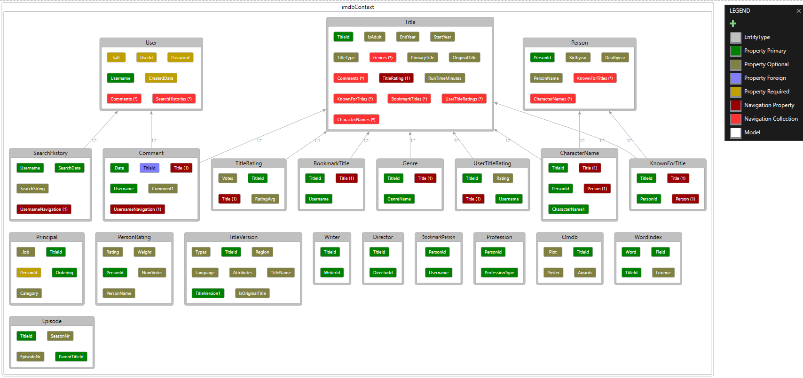

<html>
	

		<h1>Git history dataservice</h1>
		<!--Basic syntax-->
		<video width="640" height="480" src="git_history_dataservice.mp4" controls loop="true" autoplay="true">
		  Sorry, your browser doesn't support HTML5 <code>video</code>
		</video>
	

	

		<h1>Git history frontend</h1>
		<!--Basic syntax-->
		<video width="640" height="480" src="git_history_frontend.mp4" controls loop="true" autoplay="true">
		  Sorry, your browser doesn't support HTML5 <code>video</code>
		</video>
	
	
	

		<h1>Git history moviedb scripts</h1>
		<!--Basic syntax-->
		<video width="640" height="480" src="git_history_moviedb_scripts.mp4" controls loop="true" autoplay="true">
		  Sorry, your browser doesn't support HTML5 <code>video</code>
		</video>
	

</html>

